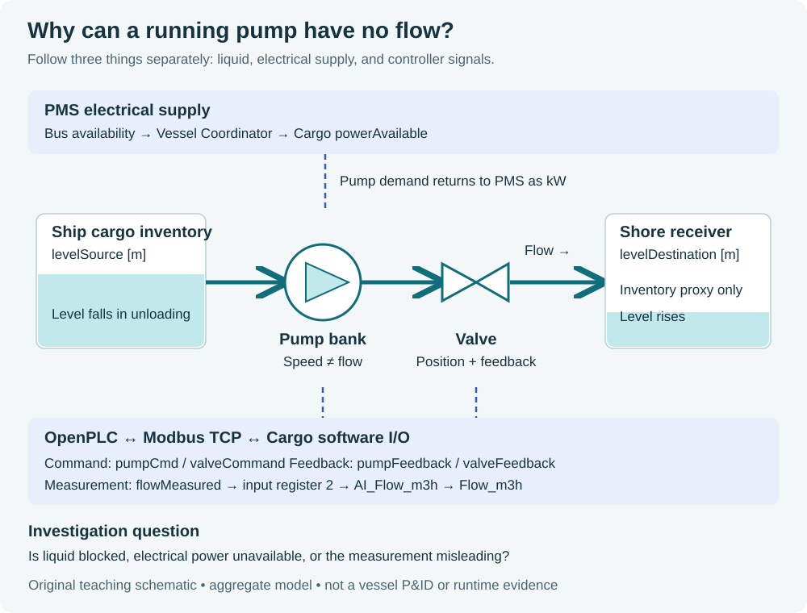

# LNG Carrier Virtual Engineering Lab

[](https://github.com/Alqaly/lng-carrier-ot-cybersecurity-lab/actions/workflows/quality.yml)

**Learn to explain an industrial event from the physical process to the PLC, network packet and operator display.**

Start with a cargo transfer. Open a valve, run the pump and watch the tank levels change.
Then investigate: **the pump reports running, but flow disappears. What would you check first?**
This lab lets you connect electrical supply, equipment feedback, measurement integrity and control logic.



*Original explanatory schematic of the aggregate teaching model, not a vessel P&ID or a screenshot.*
The shore receiver is a mass-balance boundary. The lab does not model a complete cryogenic terminal.

## Choose one starting point

| What you want | Start here | First useful result |
|---|---|---|
| Understand the project without installing anything | [Visual guide](docs/00-learning/visual-guide.md) | Explain a pump command, feedback and flow measurement |
| Read the course in your browser | Course commands below | A local website with search and learning checkpoints |
| Run your first process exercise | [Setup from a fresh or existing checkout](docs/04-build/first-run.md) | Observe Cargo flow and decode its raw I/O values |
| Investigate a running lab | [First Cargo investigation](docs/06-scenarios/first-cargo-investigation.md) | Distinguish a sensor bias from a pump failure |
| Commission and validate the complete stack | [Gates A–G](docs/04-build/commissioning-orchestrator.md) | Retain evidence for PLC, HMI, historian, experiments and recovery |

## Open the course

With Git, Docker and Docker Compose v2 already installed, run these commands **in a new directory**:

```bash
git clone https://github.com/Alqaly/lng-carrier-ot-cybersecurity-lab.git
cd lng-carrier-ot-cybersecurity-lab
./labctl docs up
```

Open **http://127.0.0.1:8088**. This starts only the documentation container.
Stop it with `./labctl docs down`.

Already have a checkout with local edits? Use the [existing-checkout instructions](docs/04-build/first-run.md#existing-checkout-with-local-changes) before updating.
No Docker? The [native Python route](docs/04-build/first-run.md#read-the-course-without-docker) serves the same course.

## Run the lab

The reference target is a private Linux host with Docker Engine and Compose v2.
The [setup guide](docs/04-build/first-run.md) covers prerequisites, credentials, ports, expected results and recovery.
After completing its prerequisite steps:

```bash
./labctl setup
./labctl preflight
./labctl build
./labctl smoke
```

Open **http://127.0.0.1:8500** for the Learning Portal, then follow the
[first Cargo exercise](docs/06-scenarios/first-cargo-investigation.md).
The first build downloads images and compiles three FMUs; there is no measured universal installation time or minimum hardware size yet.

At this stage, direct Modbus exercises let you study the process before configuring the PLCs.
OpenPLC, OPC UA, FUXA and historian commissioning follow in the [full walkthrough](docs/04-build/software-lab-walkthrough.md).
For a retained acceptance run, use `./labctl commission start` instead of repeating the individual build/demo sequence.

## Follow one real signal mapping


*Worked arithmetic, not a captured sample.* The mapping is implemented in
[Cargo I/O configuration](io_emulator/configs/cargo.json) and
[Cargo Structured Text](openplc/cargo/CargoControl.st).
The [signals lesson](docs/02-ot-foundations/signals-and-io.md) explains scaling, address spaces and command/feedback differences.
The [packet exercise](docs/06-scenarios/first-cargo-investigation.md#read-the-packet) connects that number to Modbus bytes.

## What runs, and what each component teaches

| Component | Purpose | Where to inspect it |
|---|---|---|
| Modelica / FMI process models | Calculate Cargo transfer, a dynamic two-generator teaching model, and dynamic pre-lube, engine, shaft and vessel response | [Model assumptions](docs/08-reference/model-assumptions.md) |
| Three software I/O devices | Translate model state and commands into Modbus objects | [Generated I/O map](docs/08-reference/generated-io-map.md) |
| Three OpenPLC runtimes | Execute Cargo, PMS and Propulsion Structured Text | [PLC commissioning](docs/04-build/openplc-editor-commissioning.md) |
| Vessel Coordinator | Couple pump/auxiliary demand and electrical power availability through process APIs | [Vessel profile](docs/03-architecture/vessel-profile.md) |
| FUXA | Operator views using commissioned OPC UA bindings | [HMI commissioning](docs/04-build/fuxa-commissioning.md) |
| Telegraf / InfluxDB / Grafana | Collect and compare time-stamped process history | [Historian](docs/04-build/historian.md) |
| Capture tools / Wireshark / Zeek | Inspect commands, responses and protocol chronology | [Packet labs](docs/05-protocols/packet-labs.md) |
| Learning Portal | Explain live model values and teaching alarms | [Data provenance](docs/08-reference/data-provenance.md) |

The control loop is **model ↔ software I/O ↔ Modbus TCP ↔ OpenPLC**.
The Vessel Coordinator uses HTTP process APIs; its coupling is not a Modbus transaction.
OPC UA carries commissioned controller values to the HMI and historian.
The public course container serves static pages and has no connection to the private control network.

## Why LNG carriers?

A power-system event can affect cargo pumping and propulsion auxiliaries at the same time.
That gives you a reason to investigate across process, controller and network boundaries.

The course compares its teaching models with public Kongsberg, Wärtsilä, ABB and SIGTTO material.
For a real experimental reference, inspect Figures 3, 9 and 10 in
[Lee's LNG-carrier PMS HIL study](https://www.mdpi.com/2077-1312/12/7/1236).
That study uses physical test equipment; this project is software-based.
[Source registry](docs/09-research/source-registry.md) ·
[Marine reference](docs/01-vessel/marine-automation-reference.md) ·
[Research limitations](docs/09-research/experimental-claim-boundaries.md)

## What is still missing?

**This is a developing educational lab. A green CI badge does not certify the learning experience or the live control loop.**

The repository has automated source checks and a standalone course build.
Public runtime screenshots, annotated PLC/HMI commissioning examples and a complete retained target-machine acceptance run are still outstanding.
The [learner-experience backlog](docs/00-learning/learner-experience-backlog.md) lists concrete deliverables and how each will be judged.

Use [release readiness](RELEASE-READINESS.md) for the evidence boundary.
This is not a class-approved vessel design, safety system or operational procedure.

## Review or contribute

With the [Python review environment](docs/04-build/first-run.md#prepare-the-lab-host) active:

```bash
./labctl review
./labctl docs build
```

For a documentation contribution, also follow its instructions as a learner:
check the initial state, each command, the expected observation and the recovery path.
A useful figure needs readable labels, a teaching question and a clear source/evidence status.

[Learning journey](docs/00-learning/learning-journey.md) ·
[Full course](docs/start-here.md) ·
[Website and Docker delivery](docs/04-build/website-and-docker.md)
