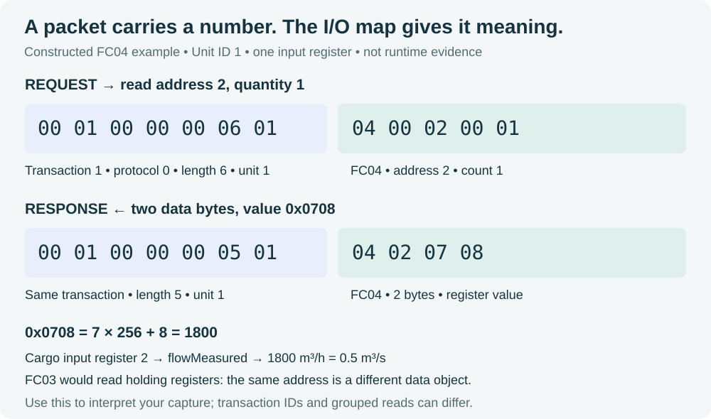

# First Cargo investigation: is the flow measurement telling the truth?

**Learning objective:** use command, feedback, actual model flow and measured flow
to distinguish a transmitter bias from pump failure. Finish with one decoded
Modbus register and a short explanation supported by your observations.

This is a pre-PLC teaching exercise. The commissioning client writes directly to
software I/O. Keep the OpenPLC programs stopped so they cannot compete with those
writes. If your PLCs are already commissioned and running, use the
[normal controller-driven scenario](normal-cargo-transfer.md) and registered experiments instead.

## Before you begin

Complete [setup](../04-build/first-run.md) through `./labctl build` and a successful
`./labctl smoke`. Open the Learning Portal at **http://127.0.0.1:8500**.
Use two terminals in the same repository directory. Do not run this exercise
during a retained acceptance experiment; it changes live process commands.


The default vessel coupling supplies Cargo electrical availability from PMS.
Starting a Cargo pump before establishing power can correctly produce no flow.

## 1. Establish electrical supply

In terminal 2:

```bash
./labctl demo pms
curl --fail --silent --show-error http://127.0.0.1:8600/state | python3 -m json.tool
```

The PMS demo starts/connects generation and leaves it operating. In the coordinator
response, inspect `links.busAvailable` and `links.cargoPowerAvailable`.
Both must be `true` before the Cargo exercise. If they are false, inspect PMS
state and service logs; do not diagnose the Cargo pump yet.

## 2. Capture before you command

In terminal 1:

```bash
./labctl capture cargo modbus
```

Leave it running until the capture command reports tcpdump is listening.
In terminal 2:

```bash
./labctl demo cargo
```

The script opens the valve, waits four seconds, commands the pump and prints
eight register/feedback samples. It then stops the pump and closes the valve.
The demo requests actions after fixed waits; it does not execute the PLC's
feedback-dependent permissive logic. That is a later commissioning milestone.

**Look for:** valve position rising before pump run-up, flow responding with lag,
source level decreasing and destination level increasing. The level change can
be small during this short run; compare values over time instead of expecting
an obvious tank animation.

After the demo ends, press Ctrl-C in terminal 1 and wait for the saved-file message.
The default output is `evidence/live/cargo/modbus.pcap`. Preserve it before another
capture uses that default filename.

## 3. Decode the terminal output

`IR` is a list of input-register values in address order, starting at zero.
`DI` is the discrete-input list. The Cargo demo prints seven IR and four DI values.

| Printed position | Signal | Convert the raw value |
|---|---|---|
| `IR[0]` | Ship source level | Divide by 1000 → m |
| `IR[1]` | Shore receiving inventory level | Divide by 1000 → m |
| `IR[2]` | Measured flow | Raw value → m³/h; divide by 3600 → model m³/s |
| `IR[3]` | Source pressure | Divide by 10 → kPa |
| `IR[4]` | Valve position | Divide by 1000 → fraction open |
| `IR[5]` | Pump speed | Divide by 1000 → normalized speed |
| `IR[6]` | Aggregate pump electrical demand | Raw value → kW |
| `DI[0]`, `DI[1]` | Valve-open and pump-running feedback | Boolean states |
| `DI[2]`, `DI[3]` | Receiving high-high and source low-low | Protective/boundary conditions |

For example, an `IR[2]` of **1800** means **1800 m³/h**, or **0.5 m³/s**.
This is arithmetic to practise; it is not an expected fixed output for your run.
The [generated I/O map](../08-reference/generated-io-map.md) is the mapping authority.

## Read the packet

Open the saved PCAP in Wireshark. Filter on `tcp.port == 5020`. Because this lab
uses a nondefault port, use **Analyze → Decode As** and select the Modbus/TCP
dissector if Wireshark only shows TCP payload. Some versions label it `MBTCP`.



The Cargo script reads seven registers from address zero, so its FC04 response
normally contains fourteen register-data bytes. Flow is the **third register**,
not the first returned value. The illustration reads only address two to make
the byte arithmetic easier to see.

Find one matching request/response and record:

1. Transaction identifier and Unit ID.
2. Function code, start address and quantity.
3. The two flow-register bytes and their unsigned integer value.
4. The engineering units obtained from the I/O map.

Also locate the valve holding-register write and pump coil write. Explain why
a successful write acknowledgement alone does not prove valve travel or liquid flow.

## 4. Compare two fault types

First write predictions for the two cases below. The existing fault scenario
establishes normal transfer, adds a +20% sensor bias, clears it, then simulates
pump failure. It labels terminal observations `NORMAL`, `BIASED` and `PUMP-FAIL`.

In terminal 1, sample the model API continuously:

```bash
while true; do
  curl --fail --silent --show-error http://127.0.0.1:8100/state | python3 -m json.tool
  sleep 1
done
```

In terminal 2:

```bash
./labctl demo cargo-fault
```

| Case | Compare | Reasoning |
|---|---|---|
| Normal transfer | `flow`, `flowMeasured`, register 2, tank levels | Establish the lagged measurement baseline |
| +20% flow sensor bias | `flowMeasured` versus `flow` | Measured flow tends toward 1.2 × actual flow after lag; actual pumping is not increased by that bias |
| Pump failure | `pumpCmd`, `pumpSpeed`, `pumpFeedback`, both flow values | Command can remain true while speed and actual transfer fall |

The fault commands are instructor inputs: holding register 20 for bias and coil
20 for pump failure. They are not ordinary PLC outputs and this exercise does not
demonstrate an attacker gaining access. Repeat later through the appropriate
registered experiment with its required evidence and claim boundary.

Stop the polling loop with Ctrl-C after the fault scenario has completed.

## 5. Check recovery and keep an explanation

On normal completion, the Cargo fault demo clears its bias/pump-failure inputs,
stops the pump and closes the valve. Poll Cargo state and confirm `pumpCmd=false`,
`valveCommand=0`, `faultPumpFail=false` and `flowSensorBiasPct=0`.
Allow physical state and measured flow to settle; they do not reset instantly.

If the command was interrupted, do not assume cleanup happened. Stop the temporary
learning stack with `docker compose stop`, inspect the failure, and establish a
known state before repeating. The PMS demo leaves generation running; stopping
the learning stack ends that session without deleting its volumes.

Write four sentences: your initial hypothesis, the observation that supported or
contradicted it, one decoded packet value, and one limit of the exercise.
You are done when you can explain why a running indication alone cannot prove
transfer. Continue to [OpenPLC commissioning](../04-build/openplc-editor-commissioning.md)
to repeat the causal chain through actual controller logic.
