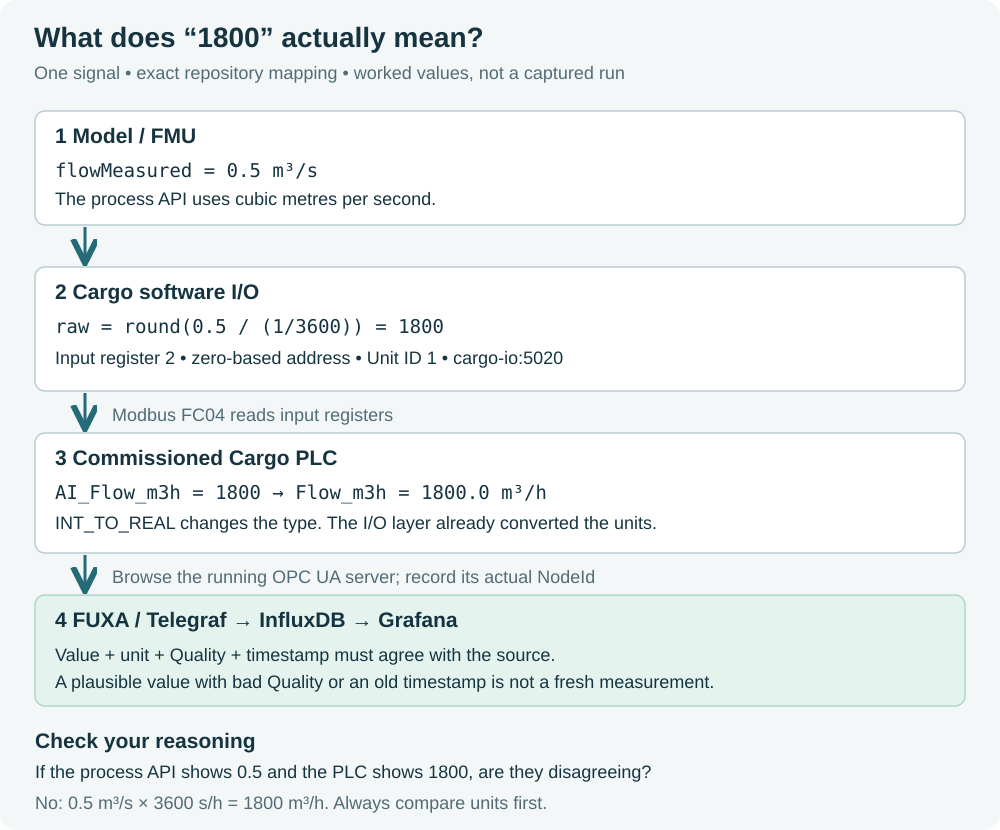

# 03 — OT Foundations You Must Be Able to Explain

## Why this matters

Most confusion in OT starts when command, output, feedback and measurement are treated as the same thing.

## Visual tour — real marine hardware concepts

Inspect the K-Chief hardware/type-approval material and note the presence of remote analog/digital I/O and gateways: https://www.kongsberg.com/maritime/contact/certificates/product-certificates/american-bureau-of-shipping-24-00t2541233-pda-cc/

Then open the official Modbus specifications: https://www.modbus.org/modbus-specifications

## Memory hook

```text
COMMAND = what we want
OUTPUT  = what we drive
FEEDBACK= what equipment says it did
MEASURE = what the process actually looks like
```

## Worked example — pump



The figure uses worked values, not a captured sample. Before comparing two
screens, compare their units: 0.5 m³/s and 1800 m³/h are the same flow. Follow
the [signals lesson](../02-ot-foundations/signals-and-io.md) for the exact register mapping.

Assume:

```text
Pump command  = ON
Pump output   = ON
Pump feedback = ON
Flow          = 0
```

That is **not** the same problem as:

```text
Pump command  = ON
Pump output   = ON
Pump feedback = OFF
Flow          = 0
```

The first can indicate a blocked hydraulic path or misleading flow measurement. The second points toward equipment/actuation/feedback failure.

## PLC scan cycle

A simplified PLC scan is:

```text
READ INPUTS → EXECUTE LOGIC → WRITE OUTPUTS → REPEAT
```

Timing matters. A PLC does not “think” once; it continually evaluates current state.

## Interlock vs permissive vs alarm vs trip

- **Permissive:** condition required before an action is allowed.
- **Interlock:** logic preventing/altering action because conditions are wrong.
- **Alarm:** information requiring attention.
- **Trip:** protective action that moves equipment/process toward a safer state.

## Lab action

Open:

- `openplc/cargo/CargoControl.st`
- `io_emulator/configs/cargo.json`
- `plant/configs/cargo.json`

Pick one signal and trace it across the three files.

## Explain it in 60 seconds

Explain command vs feedback using the Cargo valve, and give one reason why independent feedback matters for cybersecurity investigation.

## Go deeper

- [OT From Zero](../02-ot-foundations/ot-from-zero.md)
- [Signals and I/O](../02-ot-foundations/signals-and-io.md)
- [Safety vs Control](../02-ot-foundations/safety-vs-control.md)
